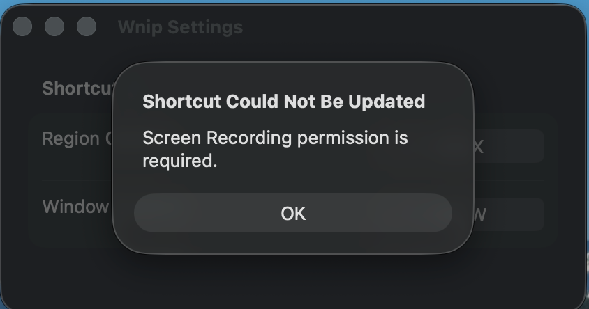
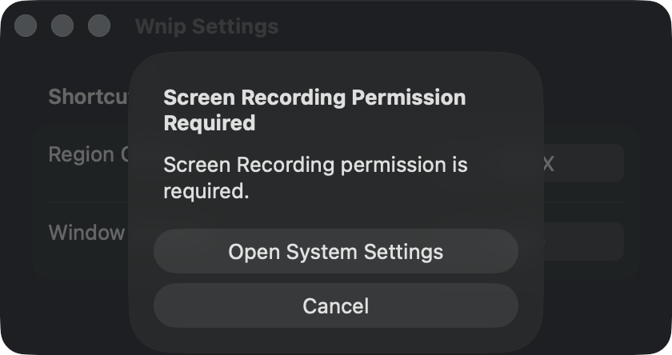

# 屏幕录制权限弹窗标题错误修复报告

- 日期：2026-09-05
- 修复范围：设置窗口错误弹窗
- 处理状态：已修复
- 发布状态：已提交并合并 `main`，本地安装完成；远端推送因 GitHub HTTPS 凭据不可用而未执行成功

## 问题与影响

- 实际行为：区域或窗口截图因缺少屏幕录制权限而失败时，设置窗口错误弹窗固定显示标题 `Shortcut Could Not Be Updated`。
- 期望行为：弹窗标题与真实错误一致；权限错误应提供进入系统设置的恢复入口。
- 复现条件：屏幕录制权限未授予，打开 Wnip 设置窗口后触发区域或窗口截图。
- 影响范围：所有通过设置窗口展示的非快捷键错误都会被错误标记为快捷键更新失败，误导用户排查方向。

## 根因

`CaptureCoordinator` 已正确产生 `.permissionDenied`、`.captureFailed` 和 `.shortcutFailed` 三类错误，但 `SettingsView` 将所有 `presentedError` 的标题硬编码为 `Shortcut Could Not Be Updated`。错误正文来自真实错误，因此出现了“快捷键更新失败”标题与“需要屏幕录制权限”正文互相矛盾的界面。

## 处理与修复点

1. 增加设置弹窗展示模型，集中生成三类错误的标题、正文和按钮配置。
2. 权限错误携带系统隐私设置 URL；设置弹窗提供 `Open System Settings` 和 `Cancel`，其他错误保持单一确认按钮。
3. 增加回归测试，覆盖权限、截图和快捷键三类展示，以及权限恢复按钮向 URL 打开器传值的行为。

## 变更范围

- `Wnip/App/CaptureCoordinator.swift`：保留三类协调器错误作为展示输入。
- `Wnip/Preferences/SettingsView.swift`：增加可测试的弹窗展示模型，并按错误类型展示标题与操作按钮。
- `WnipTests/App/CaptureCoordinatorTests.swift`：增加错误展示语义回归测试。

## 修复前后对照

### 对照 1：未授予屏幕录制权限时触发区域截图

环境：本地安装 `/Applications/Wnip.app`；设置窗口 420 × 222 pt；深色模式；默认区域快捷键 `⇧⌘X`。修复前截图由用户提供。

修复前：

修复后：

可观察差异：标题改为 `Screen Recording Permission Required`，并新增 `Open System Settings` 恢复入口；权限错误正文与快捷键设置内容未被改变。

## 自动验证

| 检查 | 命令或方式 | 结果 |
|---|---|---|
| 缺陷回归测试 | `xcodebuild test ... -only-testing:WnipTests/CaptureCoordinatorTests` | 15 项通过，0 失败 |
| 完整测试 | `xcodebuild test -project Wnip.xcodeproj -scheme Wnip -destination 'platform=macOS' -derivedDataPath DerivedDataFull CODE_SIGNING_ALLOWED=NO` | 114 项通过，0 失败 |
| Release 构建 | `xcodebuild build -project Wnip.xcodeproj -scheme Wnip -configuration Release -destination 'platform=macOS' -derivedDataPath DerivedDataRelease CODE_SIGNING_ALLOWED=NO` | 成功 |
| 界面交互验证 | 打开设置 → 触发区域截图 → 检查权限弹窗 | 标题、正文和两个操作按钮均正确 |

## 已知限制

- 当前应用仍需要用户在 macOS 系统设置中主动授予屏幕录制权限；本修复只纠正提示和恢复入口，不绕过系统权限要求。
