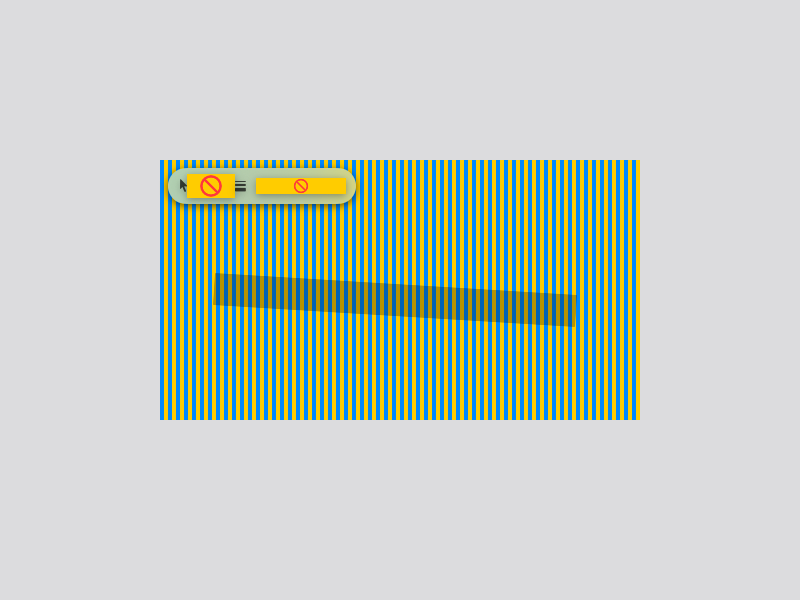
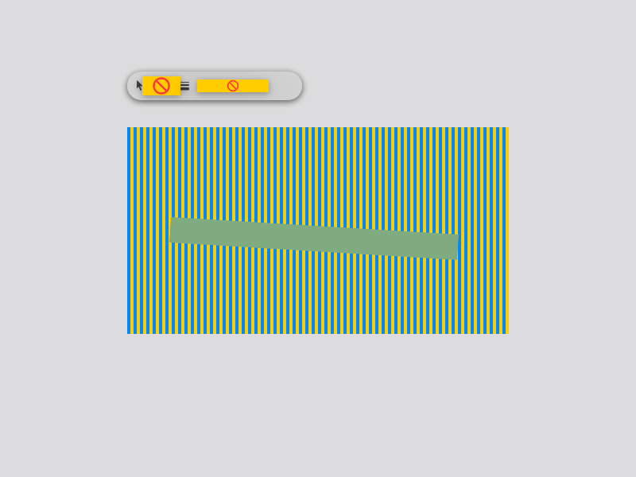

# 恢复遗漏的截图编辑功能

- 日期：2026-09-05
- 代码状态：已恢复并通过自动测试
- 安装状态：本次 Release 产物已完整替换 `/Applications/Wnip.app`，并从该路径启动
- 交互状态：组件渲染和回调测试通过；安装版手工交互待确认，CUA 连接超时

## 原因

上一轮仅核查了分支，没有接入或安装遗漏实现。真正的马赛克、参数栏外置、文字输入及输出扩展等代码留在 `.worktrees/implementation` 的未提交文件中。当前主目录的标注流程还有一批未提交接入改动，恢复时将这些与本任务直接相关的代码整合并验证，没有覆盖两个旧工作树。

当前基线马赛克只绘制半透明黑色笔画，参数栏按选区坐标加 8 点内边距放在内部。仅替换工具图标无法修复这两个问题。

## 已恢复功能

1. 真正的源图像素化马赛克，包括实时预览、笔刷遮罩、导出，以及裁剪时稳定的像素网格。
2. 在截图覆盖层出现前保存显示器源图，编辑预览与导出使用同一份冻结图像。
3. 颜色/线宽栏优先放在选区左上方外侧；避让尺寸标签及主工具栏；顶部不足放下方，无外部空间时回退内部安全位置。
4. 参数栏和主工具栏的点击区域从圈选手势中排除，保留主目录已有的标注接入和选区锁定修复。
5. 按内容计算文字输入框尺寸，切换工具、复制和保存时提交正在编辑的文字。
6. PNG/JPEG 输出、JPEG 质量、命名规则、同名编号避让、保存目录记忆和失效回退；取消保存后保持编辑状态并允许重试。
7. 区域/窗口阴影设置、完成通知、提示音、触觉反馈及对应设置项。
8. 应用图标、菜单栏图标、选中工具提示及深色系统主题下的图标可见性。
9. 保留 main 的区域/窗口双快捷键、旧设置迁移和快捷键注册失败保护。

没有将旧的单快捷键设置实现整体覆盖 main，也未删除旧工作树或其未提交文件。

## 渲染前后对照

以下是用变更前备份源码与恢复后源码分别运行同一个 SwiftUI 组件渲染程序生成的 800 × 600 图像，测试数据为固定蓝黄条纹、同一选区和同一笔画。它们是组件渲染对照，不是已安装应用的桌面截图。原生颜色选择器和滑块在 SwiftUI ImageRenderer 中显示为不支持的占位符，不能据此判断真实控件外观。

修复前：参数栏在选区内部，黑色透明笔画下仍保留细条纹。

修复后：参数栏移到选区上方；笔画覆盖处的细条纹已被像素化采样。因测试条纹周期均匀，多个采样块颜色相同，表现为均匀色带；不同颜色块、源图坐标及裁剪网格另由像素级测试验证。

## 自动验证

| 检查 | 结果 |
|---|---|
| `xcodebuild test -quiet -project Wnip.xcodeproj -scheme Wnip -destination 'platform=macOS,arch=arm64' -derivedDataPath DerivedData CODE_SIGNING_ALLOWED=YES` | 159 项通过，0 失败，0 跳过 |
| 马赛克画布、输出像素、Retina 裁剪、透明区域、网格锚点 | 通过 |
| 参数栏顶部/底部避让、负坐标显示器、全屏回退 | 通过 |
| 保存回调使用输出设置、取消后重试、双快捷键与设置持久化 | 通过 |
| 深色模式工具图标与品牌资源加载 | 通过 |
| `git diff --check` | 通过 |
| `bash scripts/install-local.sh` | Release 构建、停止所有 Wnip 进程、完整替换、签名检查、固定路径启动全部成功 |
| 安装版与构建产物可执行文件 SHA-256 | 一致，见下方 |

首次全量测试发现恢复流程错误地清除了尚未解决的快捷键注册错误，已修复为保留该错误；上述 159 项为修复后的最终完整测试结果。

## 安装证据

- 已运行可执行文件：`/Applications/Wnip.app/Contents/MacOS/Wnip`。
- 安装时旧应用完整移入废纸篓，未在运行中覆盖应用包。
- 已取消其他构建副本的系统注册。
- 新旧安装均使用项目既有稳定签名身份；未修改系统授权。
- 构建及安装可执行文件 SHA-256：`3f4c5830020a86097caf17fda470bda9628284e3982414f2f286eb43667c0555`。
- 检查最近日志未发现本次安装进程的错误记录；旧进程及故意损坏书签的测试进程日志未混为安装版运行结果。

## 验证边界

CUA 连接 `/Applications/Wnip.app` 持续超时，未取得安装版的实际鼠标交互截图。因此不将组件测试描述为端到端手工验证，也不宣称已验证系统通知实际弹出或触觉反馈实际产生。已请用户在安装版验证九宫格马赛克和外置参数栏，待收到结果后补充。

## 工作区保护

- 提交范围为本次恢复源码、资源及测试，包括其依赖的当前标注接入改动。
- 之前的签名配置改动、安装脚本、签名说明以及其他排查报告保留在原工作区，不夹带提交。
- 本任务直接在 main 恢复，不需要合并新分支。
