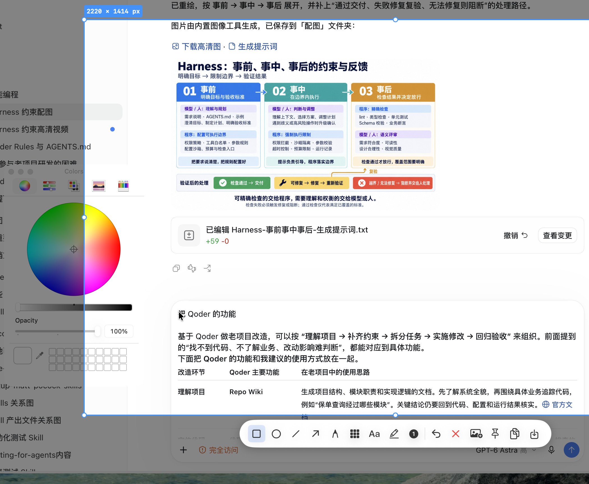
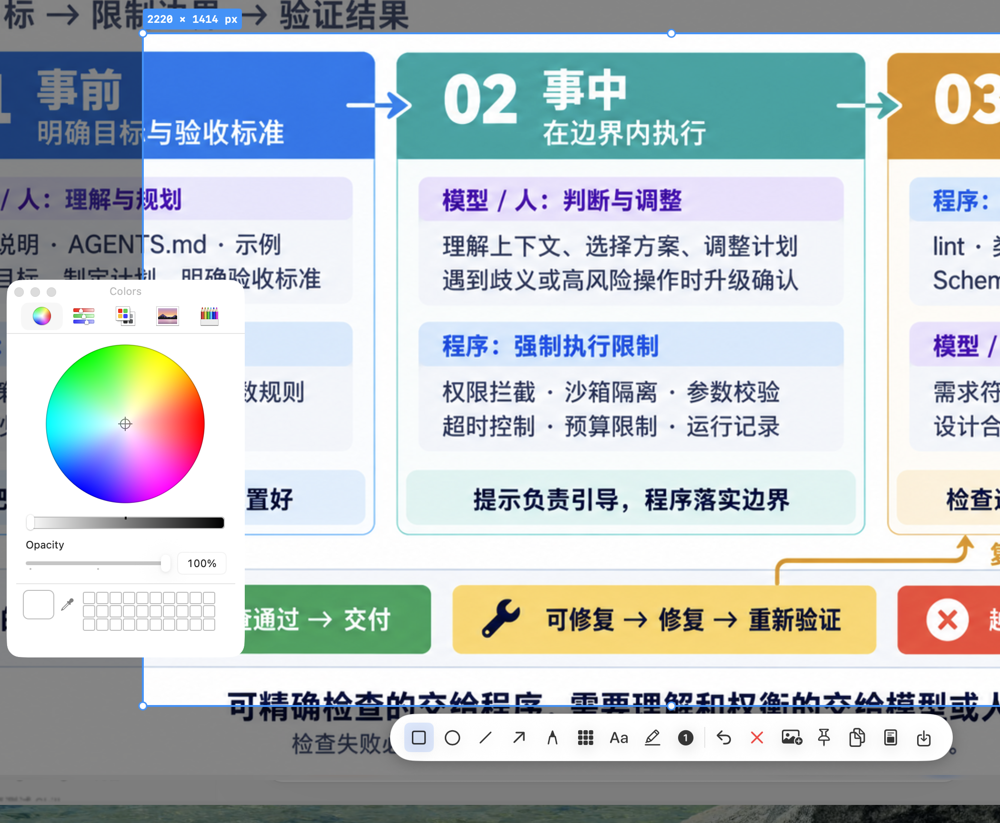

# 截图标注颜色选择框延迟弹出修复 测试报告

## 一、基本信息与结论

| 项目 | 内容 |
| --- | --- |
| 任务 / Issue | 截图标注时点击颜色按钮，颜色选择框（NSColorPanel）未弹出；截图完成后才弹出。无独立 Issue，来自用户直接反馈 |
| 代码分支与测试版本 | 分支 `main`；基线提交 `d3bedd5`；修复以工作区改动构建验证并安装实测，修复提交随本报告一同入库。测试期间工作区存在其他任务的未提交改动（预览导出、窗口选区等），已隔离，未纳入本次提交 |
| 测试日期 | 2026-10-04 14:09–14:53（UTC+8） |
| 测试环境 | macOS 26.6.2 (25G83)，arm64；Xcode 27.0；工程目标 macOS 15.0+；单元测试宿主为 Wnip.app（同证书调试签名，已持屏幕录制授权） |
| 测试范围 | BUG-01（标注工具栏颜色选择框层级）；回归范围为全部 WnipTests |
| 测试结论 | **通过**。根因两层均已定位并修复；3 条新增回归用例通过，全量套件 198 条全部通过；已安装新版（PID 11640）由用户实测确认：颜色面板在截图覆盖层之上即时弹出。第一版修复（仅会话级浮动）曾安装实测失败，经插桩定位第二层原因后修复，过程见第四节 |

## 二、验收标准对照

| Bug 编号 | 原始症状 | 预期行为 / 验收标准 | 验证方式 / 用例 | 结果 |
| --- | --- | --- | --- | --- |
| BUG-01 | 截图框选后点击工具栏颜色按钮，颜色选择框不弹出；截图完成（覆盖层关闭）后面板才出现 | 标注阶段点击颜色按钮，颜色面板立即浮现在截图覆盖层之上并可交互取色；覆盖层关闭后面板层级恢复原状 | 新增回归 `ColorPanelOverlayTests` 3 条；真屏证据 harness（修复前后）；已安装版本用户实测 | 通过 |

## 三、自动化测试结果

| 用例 / 测试层 | 类别 | 关联 Bug / 覆盖范围 | 执行命令 | 预期结果 | 实际结果 | 状态 |
| --- | --- | --- | --- | --- | --- | --- |
| ColorPanelOverlayTests/testColorPanelFloatsAboveCaptureOverlayWhileAnnotating | 本次新增回归 | BUG-01（会话浮动） | `xcodebuild test -project Wnip.xcodeproj -scheme Wnip -destination 'platform=macOS' -derivedDataPath DerivedData -only-testing:WnipTests/ColorPanelOverlayTests` | 修复前失败、修复后通过 | 修复前（14:11:31）：`XCTAssertGreaterThan failed: ("3") is not greater than ("1000")`；修复后：通过（0.194s） | 通过 |
| ColorPanelOverlayTests/testColorPanelLevelIsRestoredAfterOverlayDismisses | 本次新增回归 | BUG-01（副作用约束） | 同上 | 覆盖层关闭后面板层级恢复原值 | 通过（0.012s） | 通过 |
| ColorPanelOverlayTests/testOverlayColorWellReassertsPanelLevelWhenPickerShown | 本次新增回归 | BUG-01（真实点击路径：显示时层级被重置） | 同上 | 模拟 macOS 26 的重置后，控件 activate 仍使面板高于覆盖层 | 通过（0.108s） | 通过 |
| WnipTests 全量套件 | 既有套件 + 新增回归 | 全模块 | 同上命令去掉 `-only-testing` | 全部通过 | 198 条通过、0 失败；最终态（清理临时文件后）复测 2.147s | 通过 |
| OnScreenColorPanelEvidenceTests（一次性上屏证据 harness，已删除） | 本次证据采集 | BUG-01 真屏行为 | `-only-testing:WnipTests/OnScreenColorPanelEvidenceTests`（修复版工作区 / 基线 `d3bedd5` worktree 各一次） | 截图期间面板层级高于覆盖层 | 修复后：`overlayLevel=1000 panelLevel=1001 panelVisible=true`，SCK 真屏截图成功；修复前：`overlayLevel=1000 panelLevel=3 panelVisible=true`，SCK 真屏截图成功 | 通过（证据见第四节） |

统计口径：198 条为 `WnipTests.xctest` 汇总值（含本次新增 3 条），未与子用例重复相加；耗时均为 xcodebuild 实测输出。修复前首次回归单条用例耗时 89.104s，系新测试宿主进程首次初始化 NSColorPanel 的开销，后续亚秒级。

关键输出（原文）：

```text
# 修复前（红，14:11:31）
XCTAssertGreaterThan failed: ("3") is not greater than ("1000") -
Color panel must float above the screenSaver-level overlay; otherwise it stays hidden
behind the fullscreen capture window until the capture ends
 Executed 2 tests, with 1 failure (0 unexpected) in 89.136 seconds

# v2 修复后（绿，14:50:38）
Test Case '...testColorPanelFloatsAboveCaptureOverlayWhileAnnotating' passed (0.194 seconds).
Test Case '...testColorPanelLevelIsRestoredAfterOverlayDismisses' passed (0.012 seconds).
Test Case '...testOverlayColorWellReassertsPanelLevelWhenPickerShown' passed (0.108 seconds).

# 最终态全量（绿）
 Executed 198 tests, with 0 failures (0 unexpected) in 2.147 seconds
** TEST SUCCEEDED **
```

## 四、改动说明与前后证据

### BUG-01 颜色选择框被截图覆盖层遮挡

- 原始问题与复现步骤：菜单栏 Wnip → Capture Region（或 ⌘⇧X）→ 框选区域 → 选一个标注工具 → 点击参数条上的颜色块。预期弹出颜色面板；实际无弹出，完成截图（覆盖层关闭）后面板才出现。
- 根因（两层，均经实测验证）：
  1. 截图覆盖层 `CaptureOverlayWindow` 是 level=1000（`.screenSaver`）的无边框全屏 `NSPanel`（`Wnip/Overlay/CaptureOverlayWindow.swift:17`）；颜色面板 `NSColorPanel` 默认 level=3（floating），`orderFront` 不提升层级，面板被压在全屏覆盖层下（修复前 harness：`panelLevel=3 < overlayLevel=1000` 且 `panelVisible=true`——面板已打开但被遮住）。
  2. **第一版修复（仅在 `present()` 时预浮动面板层级）安装后用户实测仍失败**。加临时插桩（`[DEBUG-cp01]`，0.25s 轮询面板状态，已清除）抓到真实点击路径：点击颜色块的瞬间，AppKit 的 `NSColorWell.activate` 显示面板时**会把面板层级重置回 floating(3)**，覆盖掉预浮动。插桩原文：

     ```text
     点击前: NSColorPanel L1001 v=false        ← 预浮动生效
     点击时: NSColorPanel L3    v=true         ← activate 重置层级，面板被覆盖层压住
     Esc 后: NSColorPanel L3    v=true 留存    ← 用户感知"关闭后才弹出"
     ```
- 修复点：
  - `Wnip/Overlay/OverlayController.swift`：`present` 时保存共享面板原层级并提升为 `screenSaver + 1`（1001），`dismissAll` 时恢复；重复进入/退出截图有判空保护，不影响背景编辑器等普通窗口场景。
  - `Wnip/Annotation/OverlayColorWell.swift`（新增）：`OverlayColorWell.activate(_:)` 在 `super.activate` 显示面板后重新断言层级为 1001，并开启面板不透明度滑杆；`OverlayColorPicker`（NSViewRepresentable）承接原 SwiftUI ColorPicker 的绑定与禁用语义，连续更新。
  - `Wnip/Annotation/AnnotationCanvas.swift`：标注参数条中的 SwiftUI `ColorPicker` 替换为 `OverlayColorPicker`（仅覆盖层场景；背景编辑器仍用系统 ColorPicker，所在窗口为普通层级，不受影响）。
- 新增回归测试：`WnipTests/Overlay/ColorPanelOverlayTests.swift`（3 条：会话浮动、关闭恢复、activate 重置后重断言——第三条直接复刻 macOS 26 真实点击路径的失败模式）。
- 修改前：点击颜色块后面板被压在昏暗遮罩下不可交互，关闭截图后才以正常亮度出现（用户实测，14:38 安装的第一版修复未解决）。
- 修改后：14:51 安装的 v2 版本由用户实测确认——点击颜色块后面板立即浮现在截图覆盖层之上，可正常取色。



图 1：BUG-01 修复前（基线 `d3bedd5` worktree 构建运行，一次性 harness 上屏 + ScreenCaptureKit 真实屏幕捕获）。面板已 `orderFront` 且可见，但被压在覆盖层遮罩下，仅在屏幕左缘露出被压暗的局部，无法交互。图片已裁剪掉菜单栏及无关桌面区域以保护隐私。



图 2：BUG-01 修复后（同 harness 场景）。颜色面板以正常亮度完整浮现在截图覆盖层与标注工具栏之上，色轮、透明度滑杆、色板均可操作。采集方式与裁剪范围同图 1。已安装版本（v2）的实测截图因用户选择不再重复操作而未留存，以用户实测确认及本 harness 真屏图为证。

## 五、代码审查与优化

| 问题 | 级别 | 处理 | 回归结果 |
| --- | --- | --- | --- |
| 连续多次进入/退出截图，面板层级可能叠加或丢失原始值 | 中 | `savedColorPanelLevel` 判空后才保存，`dismissAll` 恢复并清空 | `testColorPanelLevelIsRestoredAfterOverlayDismisses` 通过 |
| AppKit 显示面板时重置层级（第一版修复漏掉的实际失败路径） | 高 | `OverlayColorWell.activate` 在 `super.activate` 后重断言层级 | `testOverlayColorWellReassertsPanelLevelWhenPickerShown` 通过 |
| 背景编辑器（普通窗口的 ColorPicker）受牵连 | 低 | 仅覆盖层场景换用 `OverlayColorPicker`；会话浮动在 `dismissAll` 时恢复 | 全量套件 198 条通过 |
| NSViewRepresentable 不响应 SwiftUI `.disabled` | 低 | 显式传入 `isEnabled`（马赛克工具时禁用，与原逻辑一致） | 代码审查 + 全量套件通过 |
| 面板打开期间覆盖层 `makeKeyAndOrderFront` 抢焦点/遮挡 | 低 | 颜色变化在视图模型内闭环，不回传 `OverlayController.update`；面板层级高于覆盖层，同层置前不影响遮挡 | 插桩观察期面板持续 `L1001 v=true`；全量套件通过 |

## 六、遗留事项与验收建议

- 未验证项目与原因：已安装版本的面板弹出截图未留存（用户实测确认后选择不再重复操作）；kimi-cu 截图工具对 screenSaver 级覆盖窗报 "not on-screen"，无法作为该窗口的截图来源，改用同签名测试宿主经 ScreenCaptureKit 采集真实屏幕。
- 剩余风险与待办：若未来 macOS 再次改变 `NSColorWell`/`NSColorPanel` 的层级行为，第三条回归用例（复刻重置路径）会先行报警。一次性 harness 与插桩已按调试纪律清除（`grep DEBUG-` 无残留），临时 worktree 已删除。
- 交付状态：14:51 完成安装（`bash scripts/install-local.sh`，Release arm64，固定开发证书签名）；旧进程退出、/Applications 完整替换、从新路径启动均通过；新旧版本签名身份一致（同一 Apple Development 证书 + Team 7PXD675DGC，新包满足旧版 DR），屏幕录制授权保留（用户复测截图功能实际可用）。界面样式门禁：本次未改动窗口布局/尺寸/圆角，颜色控件由 SwiftUI ColorPicker 换成 NSColorWell（28×28 色块），用户实测中视觉与交互正常。
- 用户复查步骤：⌘⇧X → 框选区域 → 点标注工具 → 点参数条颜色块 → 面板应立即浮现在截图界面上；Esc 退出后再进截图行为一致；背景编辑器中的取色不受影响。
